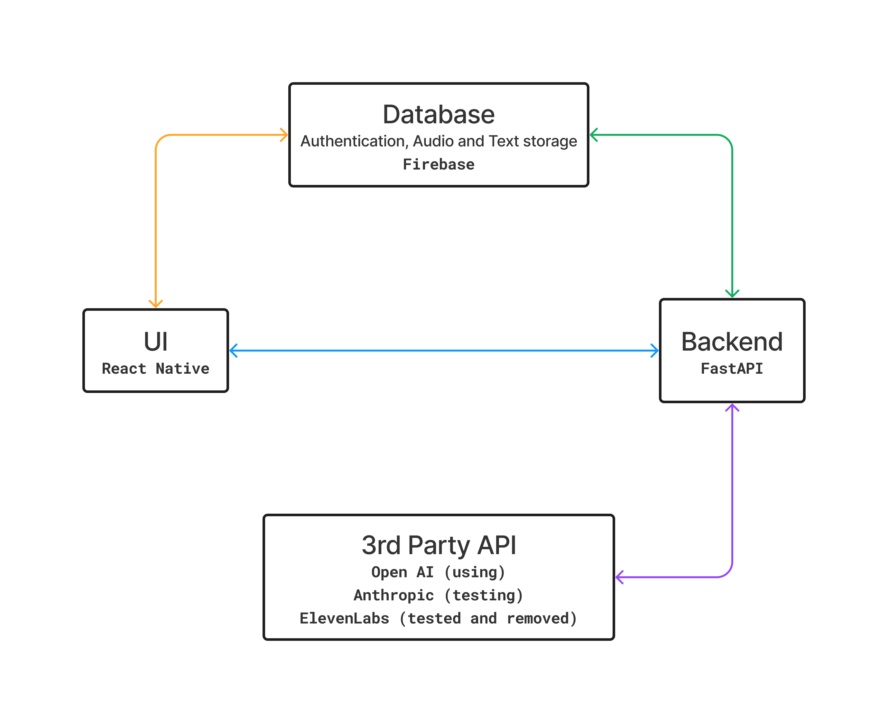
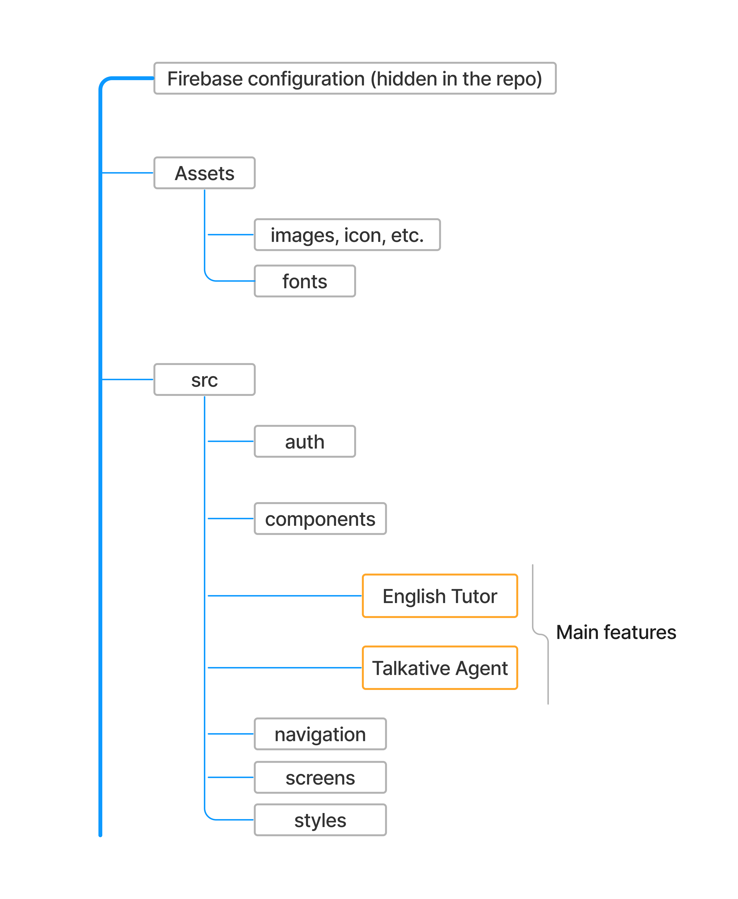

  
Table of Contents

  <ol>
    <li><a href="#what-does-the-app-do">What does the app do?</a></li>
    <li><a href="#how-did-I-make-the-app">How did I make the app?</a></li>
    <li><a href="#app-design">App design</a></li>
    <li><a href="#ui-code-structure">UI code structure</a></li>
    <li><a href="#backend">Backend</a></li>
    <li><a href="#future-improvement">Future improvement</a></li>
  </ol>

## What does the app do?

For now, this IOS app provides 2 main features

1. English Tutor: The AI engine behind the backend was designed to act as an English tutor focusing on IELTS speaking practices
2. Talkative Agent: The AI engine behind the backend was prompted to generate hilarious jokes - just for making fun conversations
3. There will be more features added to this app in the future when I have time and more ideas :)

Users can select responses (i.e., text messages and associated audio files) and save them to firebase cloud and retrieve them whenever needed.

Right now, the app is available for testing on TestFlight in the AppStore, so if you're interested in trying it out, please get in touch with me, and I'll add you as a tester.

<a href="https://youtu.be/myqkETtYNiU">Demo video</a>

## How did I make the app?

I usually begin by designing the three main parts of an app: the user interface (UI), the backend, and the database. After that, my workflow goes like this:

-   Then, I code the UI without adding any functions to it yet.
-   Next, I work on coding the backend and start adding some features to the UI.
-   Finally, I configurate the connection between the UI, the backend, and the database, and complete the functionality.

*   Note: Usually, I would spend some time on designing the UI; but I didn't do the UI design for this app.

## App design

  

## UI code structure

  

## Backend

Link to the backend repository <a href="https://github.com/LeoUtas/thehappycave_backend.git">The happy cave backend</a>

## Future improvement

There are things I will keep doing for future improvement:

-   Better notification messages (e.g., SignUp, SignIn, etc.)
-   More user-friendly authentication mechanism
-   Use animation to make the app more fun

Please give me your suggestion, thank you

I'm excited to share this work. Please feel free to explore its functionalities. Thank you for this far. Have a wonderful day ahead!

Best, Hoang Ng
